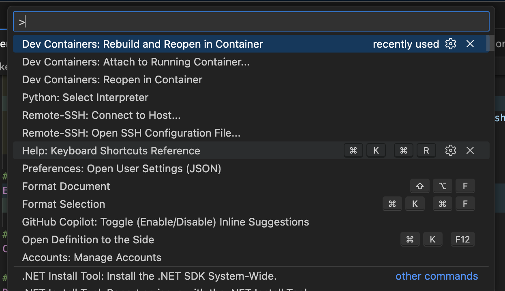
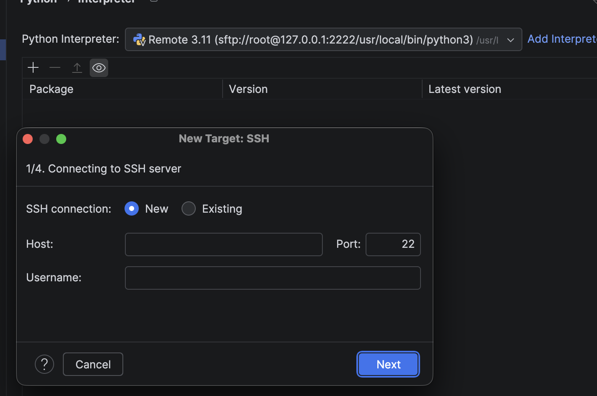

# DevContainer 实践：VS Code vs JetBrains 深度对比

## 为什么需要 DevContainer

作为 GIS 后端开发，我经常遇到这些痛点：

- **环境依赖复杂**：Python + C++ 扩展（GDAL、Shapely）编译环境难以统一
- **团队协作困难**：「在我电脑上能跑」成为日常
- **迁移成本高**：换电脑或服务器部署时重新折腾环境

DevContainer 的核心思想很简单：**把开发环境装进容器，代码挂载进去，IDE 连进去开发**。

## 我的测试配置

### devcontainer.json

```json
{
  "name": "Python Development Container",
  "dockerComposeFile": "../docker-compose.yml",
  "service": "app",
  "workspaceFolder": "/app",
  "customizations": {
    "vscode": {
      "extensions": [
        "ms-python.python",
        "ms-python.vscode-pylance",
        "ms-python.black-formatter"
      ],
      "settings": {
        "python.defaultInterpreterPath": "/usr/local/bin/python",
        "editor.formatOnSave": true
      }
    }
  },
  "postCreateCommand": "pip install --upgrade pip",
  "forwardPorts": [5000],
  "remoteUser": "root"
}
```

### docker-compose.yml

```yaml
version: '3.8'

services:
  app:
    image: mpython:latest
    container_name: python-dev
    ports:
      - "5001:5000"
    volumes:
      - .:/app
      - vscode-server:/root/.vscode-server  # 持久化 VS Code Server
    environment:
      - PYTHONUNBUFFERED=1
    working_dir: /app
    stdin_open: true
    tty: true
    command: sleep infinity

volumes:
  vscode-server:
    name: vscode-server
```

### Dockerfile

```dockerfile
FROM python:3.11-slim

WORKDIR /app

RUN apt-get update && apt-get install -y \
    build-essential git curl vim \
    openssh-server openssh-client \
    && mkdir -p /run/sshd \
    && ssh-keygen -A \
    && sed -i 's/#PermitRootLogin prohibit-password/PermitRootLogin yes/' /etc/ssh/sshd_config \
    && echo 'root:yourpassword' | chpasswd \
    && rm -rf /var/lib/apt/lists/*

ENV PYTHONUNBUFFERED=1 PYTHONDONTWRITEBYTECODE=1

COPY requirements.txt .
RUN pip install --no-cache-dir -r requirements.txt

EXPOSE 5000 22
CMD ["/usr/sbin/sshd", "-D"]
```


## VS Code：原生支持，体验丝滑

VS Code 的 Dev Containers 扩展是官方出品，体验最流畅。

### 使用方式

`Cmd + Shift + P` 打开命令面板，输入 `Dev Containers`：



常用命令：
- **Rebuild and Reopen in Container**：重建容器并打开
- **Reopen in Container**：直接在现有容器中打开
- **Attach to Running Container**：连接到已运行的容器

### 优点

| 特性 | 说明 |
|------|------|
| 一键启动 | 打开项目自动检测 `.devcontainer`，提示进入容器 |
| 扩展同步 | `devcontainer.json` 中定义的扩展自动安装到容器 |
| 端口转发 | 自动转发，本地直接访问 `localhost:5000` |
| 热重载 | 代码修改实时同步，无需重启容器 |

### 持久化建议

为了避免每次重建容器都重新下载 VS Code Server 和扩展，建议在 `docker-compose.yml` 中添加：

```yaml
volumes:
  - vscode-server:/root/.vscode-server
```

这样重建容器后秒连，扩展也都在。

---

## JetBrains（PyCharm）：功能强但有坑

PyCharm 从 2023.3 开始支持 Dev Containers，2025.3 新增了「Native 模式」。

### 启用 Dev Container 支持

`Settings → Advanced Settings → Dev Containers`：


勾选 **Open devcontainer projects natively** 开启原生模式。
注意,如果你不用原生模式 ide(2025.3)版本以下,那么你需要下载ide到你的容器里面(这个很大)

### 实际使用

打开项目后，PyCharm 会检测 `.devcontainer` 并构建：


可以看到终端已经进入容器（`root@61634a949bd3:/app#`）


### 最大的坑：Python Interpreter 配置

这是我踩的最大的坑。PyCharm 的 Native Dev Container 模式下，**无法直接识别容器内的 Python 解释器**。

点击 `Add Interpreter`，只能选择 SSH 方式：



这意味着你需要：
1. 容器内安装并启动 SSH 服务
2. 暴露 22 端口
3. 手动配置 SSH 连接（`root@127.0.0.1:2222`）

这就是为什么我的 Dockerfile 里有 `openssh-server` 的原因。

### JetBrains 的问题汇总

| 问题 | 说明 |
|------|------|
| Interpreter 配置繁琐 | 必须通过 SSH，不能直接识别容器 Python |
| 扩展/插件不同步 | `devcontainer.json` 的 `customizations.jetbrains` 支持有限 |
| 功能尚不完善 | Native 模式是 2025.3 新功能，还在迭代 |


---

## 对比总结

| 对比项 | VS Code | PyCharm |
|--------|---------|---------|
| 开箱即用 | ⭐⭐⭐⭐⭐ | ⭐⭐⭐ |
| Interpreter 配置 | 自动识别 | 需要 SSH |
| 扩展同步 | 完善 | 有限 |
| 调试体验 | 良好 | 更强（断点、变量监控） |
| 资源占用 | 轻量 | 较重 |
| 适合场景 | 快速开发、轻量项目 | 大型项目、需要高级 IDE 功能 |

## 我的选择

**日常开发用 VS Code**，因为：
- Dev Container 体验丝滑
- 启动快，资源占用少
- 对 3D Tiles、GIS 相关开发够用

**复杂调试用 PyCharm**，通过 SSH 方式连接容器。


## 参考资料

- [VS Code Dev Containers 文档](https://code.visualstudio.com/docs/devcontainers/containers)
- [JetBrains Dev Container Native 模式](https://www.jetbrains.com/help/idea/open-project-with-dev-container-natively.html)
- [devcontainer.json 规范](https://containers.dev/implementors/json_reference/)
