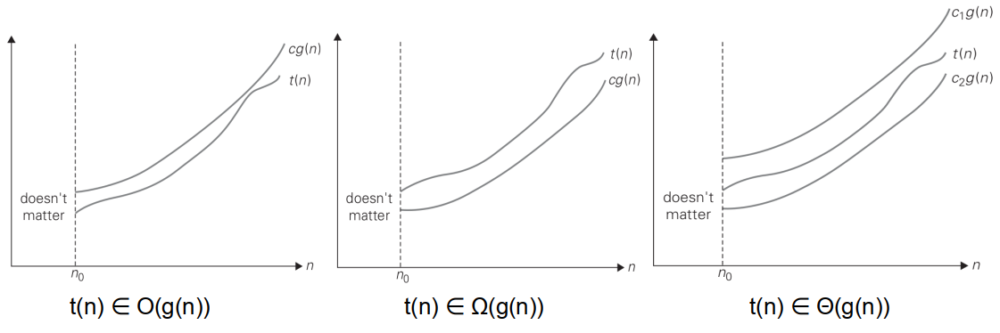

# 算法复杂度的渐进符号定义与理解

## 常数形式定义

### Big-O (上界)
$T(N) = O(f(N))$ if there are positive constants $c$ and $n_0$ such that $T(N) \leq c \cdot f(N)$ when $N \geq n_0$.

### Big-Omega (下界)
$T(N) = \Omega(g(N))$ if there are positive constants $c$ and $n_0$ such that $T(N) \geq c \cdot g(N)$ when $N \geq n_0$.

### Big-Theta (紧确界)
$T(N) = \Theta(h(N))$ if and only if $T(N) = O(h(N))$ and $T(N) = \Omega(h(N))$.

### Little-o (严格上界)
$T(N) = o(p(N))$ if, for all positive constants $c > 0$, there exists an $n_0$ such that $T(N) < c \cdot p(N)$ when $N > n_0$.

等价定义: $T(N) = o(p(N))$ if $T(N) = O(p(N))$ and $T(N) \neq \Theta(p(N))$.

### Little-omega (严格下界)
$T(N) = \omega(q(N))$ if, for all positive constants $c > 0$, there exists an $n_0$ such that $T(N) > c \cdot q(N)$ when $N > n_0$.

---

## 极限形式定义

### 1. Big-O (上界)

**极限定义**:
$$T(N) = O(f(N)) \iff \limsup_{N \to \infty} \left| \frac{T(N)}{f(N)} \right| < \infty$$

**直观理解**: $T(N)$ 与 $f(N)$ 的比值**最终有界**。

---

### 2. Big-Omega (下界)

**极限定义**:
$$T(N) = \Omega(g(N)) \iff \liminf_{N \to \infty} \left| \frac{T(N)}{g(N)} \right| > 0$$

**直观理解**: $T(N)$ 与 $g(N)$ 的比值**最终有正下界**。

---

### 3. Big-Theta (紧确界)

**极限定义**:
$$T(N) = \Theta(h(N)) \iff 0 < \liminf_{N \to \infty} \left| \frac{T(N)}{h(N)} \right| \leq \limsup_{N \to \infty} \left| \frac{T(N)}{h(N)} \right| < \infty$$

**等价表述**: $T(N) = O(h(N))$ 且 $T(N) = \Omega(h(N))$。

**直观理解**: $T(N)$ 与 $h(N)$ 的比值**既有上界又有下界**,被"夹逼"在两个正常数之间。

---

### 4. Little-o (严格上界)

**极限定义**:
$$T(N) = o(p(N)) \iff \lim_{N \to \infty} \frac{T(N)}{p(N)} = 0$$

**直观理解**: $T(N)$ 的增长速度**严格慢于** $p(N)$,比值趋于零。

---

### 5. Little-omega (严格下界)

**极限定义**:
$$T(N) = \omega(q(N)) \iff \lim_{N \to \infty} \frac{T(N)}{q(N)} = \infty$$

**直观理解**: $T(N)$ 的增长速度**严格快于** $q(N)$,比值趋于无穷。

其实从定义可以理解就是说，T(N)和g(N)函数之间的比值，如果是常数关系，由极限的定义，可以表示为T(N)和g(N)的增长速率保持同步，或者更通俗一些，无法互相甩掉彼此，如果是无穷的话，那么意味着T(N)的增长倍率远远高于g(N)

---

## 上极限($\limsup$)的理解

### 数学定义

$$\limsup_{n \to \infty} x_n = \inf_{n \geq 0} \sup_{k \geq n} x_k = \inf\{\sup\{x_k : k \geq n\} : n \geq 0\}$$

### 可视化理解

**图示说明**:
- **蓝色点**: 数列 $\{x_n\}$ 的各项
- **上红线**: $b_n = \sup_{k \geq n} x_k$ (从第 $n$ 列往后所有点的上确界,单调递减)
- **下红线**: $c_n = \inf_{k \geq n} x_k$ (从第 $n$ 列往后所有点的下确界,单调递增)

**关键理解**:
- 每一列(垂直方向)代表从该位置往后的**所有无穷多个点**
- 上红线高度 = 该列及之后所有点的**最高点**(上确界)
- **$\limsup$** = 所有上红线高度中的**最小值**(即上红线的极限高度)

数列收敛当且仅当 $\limsup_{n \to \infty} x_n = \liminf_{n \to \infty} x_n$。

---

## 具体例子: 证明 $3N^2 + 5N = O(N^2)$

### 使用极限定义证明

计算比值:
$$\frac{T(N)}{f(N)} = \frac{3N^2 + 5N}{N^2} = 3 + \frac{5}{N}$$

计算 $b_n$ (从第 $n$ 项往后的上确界):
$$b_n = \sup_{k \geq n} \left(3 + \frac{5}{k}\right) = 3 + \frac{5}{n}$$

**说明**: 当 $k = n$ 时,$\frac{5}{k}$ 达到最大值 $\frac{5}{n}$。

计算上极限:
$$\limsup_{N \to \infty} \frac{T(N)}{f(N)} = \lim_{n \to \infty} b_n = \lim_{n \to \infty} \left(3 + \frac{5}{n}\right) = 3$$

**结论**: 因为 $3 < \infty$,所以 $T(N) = O(N^2)$ 

实际上,由于 $\liminf = \limsup = 3$,还可以得出 $T(N) = \Theta(N^2)$。

---

## 复杂度可视化

### 渐进符号对比图

### 常见复杂度增长曲线

**常见复杂度从低到高**:
$$O(1) < O(\log N) < O(N) < O(N \log N) < O(N^2) < O(N^3) < O(2^N) < O(N!)$$

## TODO 待证明三个延伸公式
---

## 参考资料

- *Data Structures and Algorithm Analysis in C++* (Mark Allen Weiss), Chapter 2
- [三种表示方法：O, Ω, Θ](https://infinityglow.github.io/study/algorithm/complexity-analysis/three-notations/)
- [大O符号 - 维基百科](https://zh.wikipedia.org/wiki/%E5%A4%A7O%E7%AC%A6%E5%8F%B7)
- [上极限和下极限 - 维基百科](http://zh.wikipedia.org/wiki/%E4%B8%8A%E6%9E%81%E9%99%90%E5%92%8C%E4%B8%8B%E6%9E%81%E9%99%90)

