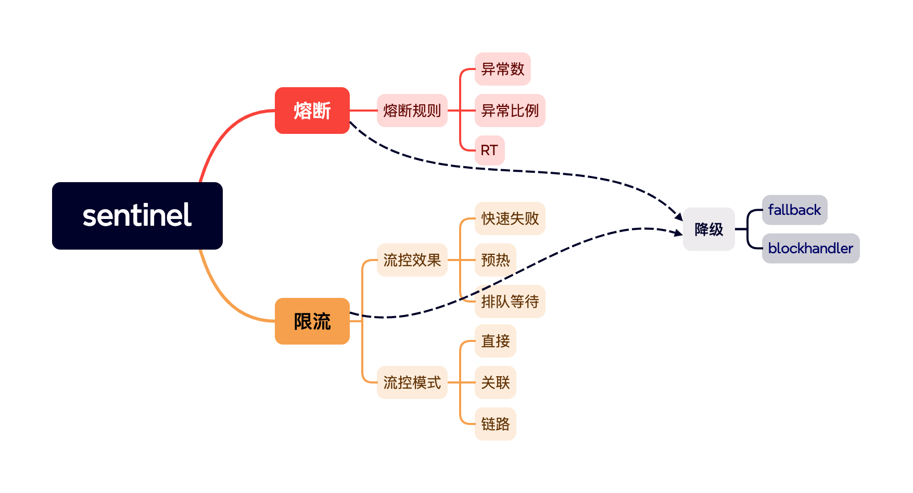
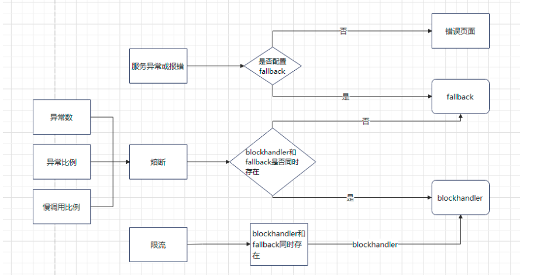

# sentinel简介


## sentinel解决什么问题
sentinel主要可以解决雪崩效应，减少服务器压力等
## sentinel主要功能
- 熔断
- 限流

# 熔断

## 重点问题
1. sentinel中可以有三种方式出发熔断，分别是RT（慢调用比例），异常数和异常比例。
2. 熔断规则和hystrix差不多。可以参考[这篇博客](https://xie.infoq.cn/article/afe2098017396dddc52e1118f),其中需要特别说明的是，
熔断器采用的是滑动窗口。

# 限流
## 流控效果
1. 快速失败:很简单的说就是达到限流标准后，请求就被拦截，直接失败。(HTTP状态码:429 too many request)，默认值
2. 预热模式，也有叫冷启动，主要是为系统启动时设置预热时间，底层有预热因子是3， 在系统刚启动时，使用的阈值不再是每秒多少个请求，而是设置
的阈值除以预热因子，在预热的时间内，逐渐提升阈值，最后达到设置的阈值(也就是每秒多少个请求)，好处是预防系统刚启动 时，突发大量的请求，服务容易宕机。
注意，默认的预热因子是3
3. 排队等待:也叫流量整形，它让请求以均匀的速度通过，单机阈值为每秒通过数量，其余的在队列
   排队等待一段时间，(即我们设置的时间，单位是毫秒)，没有超过这个时间都能被及时处理，如
   果超过了这个等待时间针对请求的接口没有线程来处理，则抛出异常

## 流控模式
1. 直接:当前资源达到限流标准时就直接限流，默认值
2. 关联:/important接口的重要程度要高于 /normal接口，如果，/important接口的访问压力很 大，那么，可以『牺牲』掉 /normal` 接口，全力保证 /important 接口的正常运行

其实也就是说，配置的关联资源是当这个关联资源达到访问量限制，对于当前接口进行流控。
3. 链路：这是颗粒度更小的一个流控方法，不仅关注指定资源，还关注了资源的上下文，对于资源的上下文进行限流。

# 熔断/限流的回掉
## fallback
1. 设定fallback处理函数
``` java 
public class ConfF {
    public static String conff(String msg){
        return "fallback";
    }
}
```
2. 制定方法上设置失败回退注解
```java
  @RequestMapping("/consumer/{msg}")
  @SentinelResource(value = "consumer",
            blockHandler = "confb",blockHandlerClass = ConfB.class,
            fallback = "conff", fallbackClass = ConfF.class)
    public String consumer(@PathVariable("msg") String msg){
        if("1".equals(msg)){
            int i = 1/0;
}
        return "con   "  + msg;
    }
```

## blockHandler回退方法
同上，只是注解不同
```java 
public class ConfB {
    public static String confb(String msg, BlockException ex){
        return "blockHandler";
    }
}
```
！注意``BlockException``

## fallback和blockhandler 同时存在的处理方法


